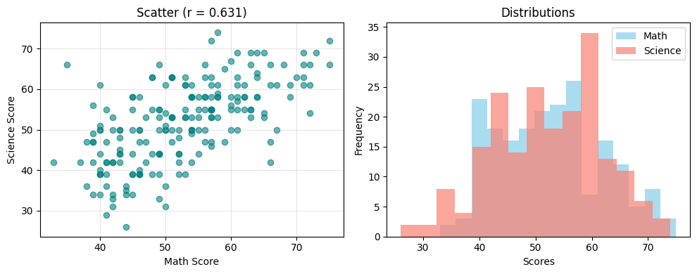
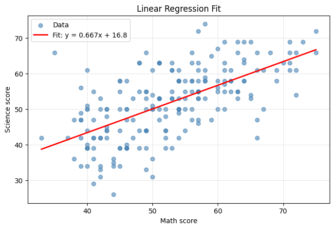
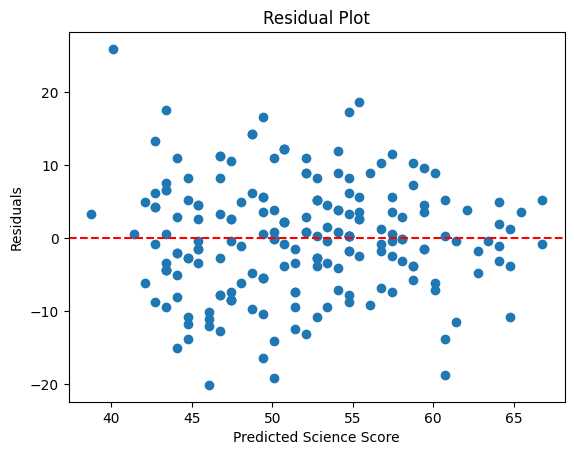
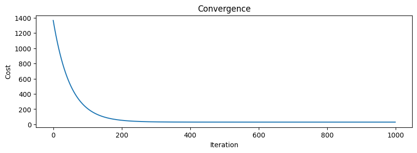

## Simple Linear Regression with Gradient Descent + Least Squares

DATA: [OpenIntro (hsb2) High School and Beyond survey](https://www.openintro.org/data/index.php?data=hsb2)

**Goal**: Predict a student science score based on their math score.

**X-Features**: math scores \
**Y-Targets**: science scores

**(Quick) Data Quality Check** \
Total 200 samples \
math:  min=33.0, max=75.0, mean=52.6, std=9.3, total=200.0 \
science: min=26.0, max=74.0, mean=51.9, std=9.9, total=200.0 \
Missing-values: math: 0, science: 0 \
Correlation: 0.631

_**Figure 1.** Exploratory Data Analysis of math and science scores
Left: Scatter plot of math vs. science scores (n=200) showing a moderate positive linear relationship (Pearson r = 0.631).
Right: Overlaid histogram of score distributions. Both variables are roughly normally distributed, with math slightly more peaked (mean=52.6, σ=9.3) and science slightly flatter (mean=51.9, σ=9.9). No missing values or extreme outliers detected._

### **Model Prediction**

Prediction: **A student who scores 40 in math, is predicted to score a 43 in science.**

$$f(x) = 0.66x + 16.75$$

The model has an average prediction error of ±7.8 science points.

**Our LinearRegression Model Results** \
w (slope)     = 0.666551 \
b (intercept) = 16.757171 \
R²            = 0.397824

**Scikit-Learn LinearRegression Model Results** \
w (slope)   = 0.666580 \
b (intercept) = 16.757895 \
R²          = 0.397824

_**Figure 2.** Simple Linear Regression Fit
Scatter plot of math vs. science scores with fitted regression line:
ŷ = 0.667x + 16.8
The line captures the overall upward trend, confirming a positive association. Data points are symmetrically scattered around the line, supporting the linearity assumption. R² = 0.398 indicates that ~40% of the variation in science scores is explained by math scores._

 

_**Figure 3.** Residuals vs. Predicted Values. Points are randomly scattered around the zero line with no obvious curvature or funnel shape, supporting linearity and homoscedasticity.
A few points exceed ±20, indicating potential influential observations, but overall, model assumptions are reasonably met._

_**Figure 4.** Cost function (½ MSE) vs. iteration during training on standardized math scores (α = 0.01, 1000 iterations).
The cost drops sharply in the first 200 iterations and plateaus near zero by iteration ~400, confirming successful convergence to the minimum. The smooth, monotonic decrease validates stable learning and appropriate learning rate._

### **Linear Regression Model Results**

The model explains about 40% of the variability in students’ science scores based on their math scores, indicating a moderate linear relationship. While math score is a useful predictor, other factors surely contribute significantly to science score performance.

**Note On Standardization**: I found it useful to standardize our feature variable (x). Standardization helps the model converge faster by reducing the range and centering the data around zero, which allows us to use a larger learning rate and achieve faster computation. After training, we de-standardize the model parameters to interpret the results in the original data units.

**Standardization:** $x' = \frac{x - \mu_x}{\sigma_x}$

**De-Standardize:** $x = x' \cdot \sigma_x + \mu_x$

## **Simple Linear Regression**

> **Note**: GitHub mobile does **not** render LaTeX math formulas.  
> For the full experience (with equations, plots, and formatting), please view this project on a **desktop browser**.

**Simple linear regression** is a statistical method used to model the relationship between two continuous variables by fitting a straight line to the data. 

It follows the linear equation:

$$f(x) = wx + b$$

Where $w$ represents the slope and $b$ the y-intercept. In practice, this equation allows for prediction of unseen values of $x$ as they can be mapped to predicted outputs $y$. 

In Linear Regression, we start by initializing the parameters of our line, typically set as:

$$w_{\text{init}} = 0.0,\ b_{\text{init}} = 0.0$$

So our initial prediction line is:

$$y = 0 \cdot x + 0 = 0$$

which is obviously not a good model. 

In Linear Regression, we perform a series of calculations that take us from this initial model to a relatively good model, this process is referred to as model training. 

In this particular model, the goal of model training is to reduce the error (or distance) between the predicted value and the actual values in our data. But before we get to reduce the error, we need to measure the error. To measure this error, we use the **squared error** formula for a single training example. The squared error is generally defined as;

$$(f_{w,b}(x^{(i)}) - y^{(i)})^2$$

here, 

$f_{w,b}(x^{(i)})$ is the prediction and $y^{(i)}$ is the true value for the i-th example. 

Pick a random sample, say the prediction for a science score given a 40 score in math was 0 (as per initial model), then the error will be 1600, as (0 - 40)**2 = 1600. Remember, the goal is to get the error as low as possible. 

For all $m$ training examples, we define the **Sum of Squared Errors (SSE)** as:

$$\text{SSE}(w,b) = \sum_{i=1}^{m} \big( f_{w,b}(x^{(i)}) - y^{(i)} \big)^2$$

This represents the **total** error across all samples. 

The **Ordinary Least Squares (OLS)** theory refers to fitting a model by minimizing the **sum of squared residuals**. This can be solved in two ways:
1. **Analytically**: Normal equations (closed-form)
2. **Numerically**: Gradient descent on ½ MSE

This project uses method #2, which we will derive in the following steps. 

To obtain an average measure of model error per observation, we divide by 𝑚, the number of training examples. This converts the Sum of Squared Errors (SSE) into the Mean Squared Error (MSE):

$$\text{MSE}(w,b) = \frac{1}{m} \sum_{i=1}^{m} \big( f_{w,b}(x^{(i)}) - y^{(i)} \big)^2 = \frac{\text{SSE}}{m}$$

This normalization ensures that the cost represents the average squared error per sample, preventing the total error from simply increasing with dataset size.

During gradient descent, we minimize a scaled version of the Mean Squared Error called the cost function, defined as:

$$J(w,b) = \frac{1}{2m} \sum_{i=1}^{m} \big( f_{w,b}(x^{(i)}) - y^{(i)} \big)^2 = \frac{1}{2} \cdot \text{MSE}$$

The factor $\frac{1}{2m}$ serves two purposes:
- Dividing by m converts the total error into an average per training example, so the cost and its gradients remain stable regardless of dataset size.
- Multiplying by 1/2 simplifies differentiation.

After training, model performance is reported using **standard MSE** (not ½ MSE).

Returning to the idea of training our model to iteratively minimize the cost function $J(w,b)$, we use an optimization algorithm called **gradient descent**, which updates parameters w and b iteratively:

$$w \leftarrow w - \alpha\frac{\partial J}{\partial w}$$

$$b \leftarrow b - \alpha\frac{\partial J}{\partial b}$$

here, $$\frac{\partial J}{\partial w}, \frac{\partial J}{\partial b}$$ are the partial derivatives of the cost function with respect to each parameter. Together, they form the gradient vector:

$$\nabla J(w,b) = \begin{bmatrix} \frac{\partial J}{\partial w} \\ \frac{\partial J}{\partial b} \end{bmatrix}$$

A gradient is a vector of partial derivatives indicating both the direction and magnitude of the steepest increase of a function. By moving in the opposite direction of this gradient (subtracting it, scaled by the learning rate $\alpha$), we iteratively descend toward the minimum of the cost function $J(w,b)$, where the total prediction error is minimized. The partial derivatives of the cost function are:

$$\frac{\partial J(w,b)}{\partial w} = \frac{1}{m}\sum_{i=1}^{m}\big(f_{w,b}(x^{(i)}) - y^{(i)}\big)x^{(i)}$$

$$\frac{\partial J(w,b)}{\partial b} = \frac{1}{m}\sum_{i=1}^{m}\big(f_{w,b}(x^{(i)}) - y^{(i)}\big)$$

After computing each partial derivative, we can plug them back into the parameter update function and iteratively perform updates as shown in the gradient descent algorithm, until our model converges, meaning the values of w and b are no longer significantly updated.

### Gradient Descent Update Rule
Repeat until convergence:

$$w \leftarrow w - \alpha\frac{1}{m}\sum_{i=1}^{m}\big(f_{w,b}(x^{(i)}) - y^{(i)}\big)x^{(i)}$$

$$b \leftarrow b - \alpha\frac{1}{m}\sum_{i=1}^{m}\big(f_{w,b}(x^{(i)}) - y^{(i)}\big)$$

For linear regression with squared error, J(w,b) is a convex quadratic, so with a reasonable learning rate, gradient descent converges to the global minimum, aka the best values of w and b.

**Note on Learning Rate**

Learning rate 𝛼 (alpha): controls the size of each update step. A smaller value ensures slow but stable convergence; a larger one speeds learning but may cause divergence.
